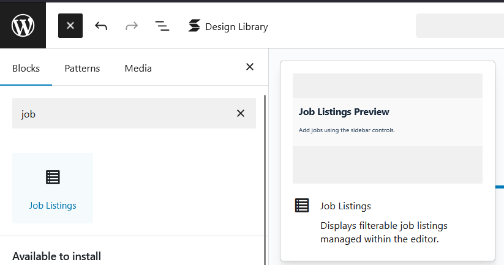
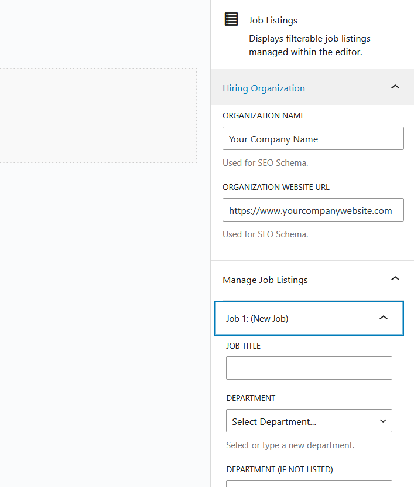
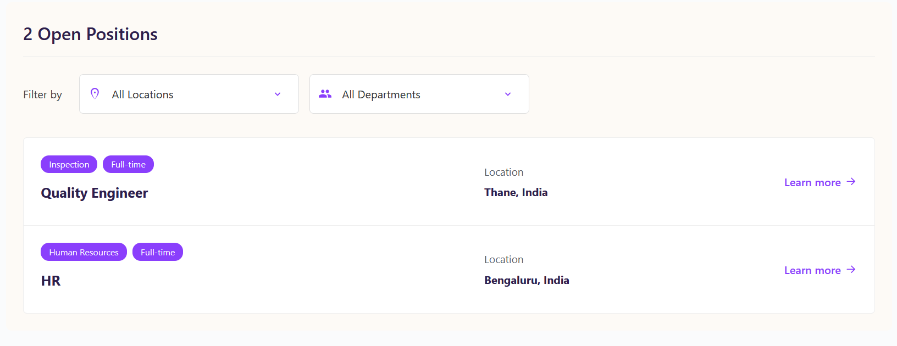
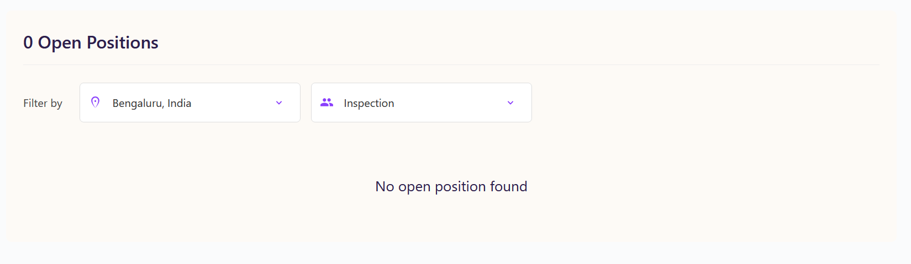

# Job Listings Block

A WordPress block plugin to display and manage filterable job listings directly within the block editor.

[](https://www.gnu.org/licenses/gpl-2.0.html)

This plugin provides a custom Gutenberg block that allows users to easily add and manage job openings on their WordPress site. It features frontend filtering and dynamic counts for a user-friendly experience.

## Features

*   **Block Editor Integration:** Manage job listings directly within the WordPress editor using sidebar controls.
*   **Customizable Job Details:** Add Title, Department, Location, Employment Type, Short Description (for SEO), and a "Learn More" URL for each job.
*   **Frontend Display:** Renders a clean, responsive list of jobs on your website.
*   **Dynamic Filtering:** Allows frontend users to filter the job list by Department and Location.
*   **Dynamic Job Count:** Displays the number of currently visible open positions, updating as filters are applied.
*   **"No Results" Message:** Shows a user-friendly message when filters result in no matching jobs.
*   **SEO Friendly:** Automatically generates JSON-LD `JobPosting` structured data to help search engines understand your listings.
*   **Customizable Hiring Org:** Set your organization's name and website URL for the SEO schema.
*   **Theme Font Inheritance:** Designed to inherit fonts from your active WordPress theme for better integration.

## Requirements

*   WordPress 6.0 or higher
*   PHP 7.4 or higher

## Installation

There are two ways to install this plugin:

**Method 1: Using the Release ZIP (Recommended for Users)**

1.  Go to the **[Releases](https://github.com/boopathirbk/Job-Listing-WordPress-Block-Plugin/releases)** page of this repository
2.  Download the latest `job-listings-block-v1.0.0.zip` file from the Assets section.
3.  Log in to your WordPress admin dashboard.
4.  Navigate to **Plugins** -> **Add New**.
5.  Click the **Upload Plugin** button at the top.
6.  Click **Choose File** and select the `job-listings-block-v1.0.0.zip` file you downloaded.
7.  Click **Install Now**.
8.  After installation, click **Activate Plugin**.

**Method 2: Building from Source (For Developers)**

1.  **Clone or Download:** Clone this repository or download the source code ZIP to your local machine.
2.  **Install Dependencies:** Open your terminal/command prompt, navigate into the plugin's directory (`job-listings-block`), and run:
    ```bash
    npm install
    ```
3.  **Build Assets:** Run the build command:
    ```bash
    npm run build
    ```
    This compiles the necessary JavaScript and CSS files into the `/build` directory.
4.  **Create ZIP:** Generate the installable ZIP file using:
    ```bash
    npm run plugin-zip
    ```
    This creates a clean ZIP file (usually in the parent directory or a `dist` folder) excluding development files like `node_modules` and `src`.
5.  **Upload:** Upload this generated ZIP file via the WordPress admin dashboard (**Plugins** -> **Add New** -> **Upload Plugin**).
6.  **Activate:** Activate the plugin after installation.

## Usage

1.  Once the plugin is activated, go to the WordPress editor for a Page or Post where you want to display the job listings.
2.  Click the **"+"** button (Block Inserter) or type `/` and search for **"Job Listings"**.
3.  Select the block to add it to your content.
4.  With the block selected, use the **Inspector Controls** (the sidebar on the right) to configure it:
    *   **Hiring Organization:** Enter your company's name and website URL (used for SEO).
    *   **Manage Job Listings:**
        *   Click **"Add Job"** to create a new listing.
        *   Click the arrow next to an existing job title (e.g., "Job 1: Quality Engineer") to expand its details.
        *   Fill in the required fields: **Job Title**, **Department**, **Location**, **Learn More URL**.
        *   Select the **Employment Type**.
        *   Add a **Short Description** (optional but recommended for SEO).
        *   Click **"Remove Job"** to delete a specific listing.
5.  **Save** or **Update** your Page/Post.
6.  View the page on the frontend to see the job listings with filters.

## Screenshots

*   *Screenshot of the block added in the editor.*

*   *Screenshot showing the Inspector Controls (sidebar options).*

*   *Screenshot of the frontend display with filters and job list.*

*   *Screenshot of the "No open position found" message.*


## Changelog

### 1.0.0 - 17-04-2025
*   Initial release.

## License

This plugin is licensed under the GPL-2.0-or-later.
See the [LICENSE](https://www.gnu.org/licenses/gpl-2.0.html) file for details (or create a LICENSE file in your repo).